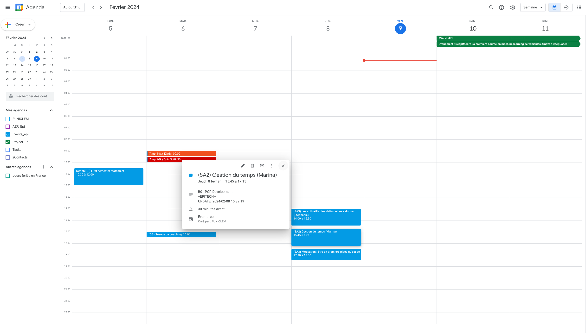

# IntrAgenda

IntrAgenda is a powerful tool to seamlessly synchronize Google Calendar with the Epitech intranet. This integration simplifies your life by effortlessly managing your academic and project schedules in one place.

## Features

IntrAgenda comes equipped with a range of features to enhance your scheduling experience:

- **Event/Session Synchronization from Intranet Agenda:** IntrAgenda ensures that all your registered events and sessions on the Epitech intranet are automatically synchronized with your Google Calendar.

- **Synchronization of Future and Ongoing Projects:** Keep track of your ongoing and upcoming projects effortlessly with the seamless synchronization of project timelines between Epitech's intranet and Google Calendar.

- **Use of Two Agendas:** IntrAgenda allows you to manage projects and sessions separately by utilizing two distinct Google Calendar agendas.

- **Automatic Login via Selenium:** Benefit from automatic login functionality using Selenium. Please note that auto-login may not be functional due to recent changes.

- **Pop-up Reminder Management:** Never miss a session with IntrAgenda's pop-up reminder management.

- **Color Management for Exams, Projects, and Sessions:** Stay organized with color-coded events, distinguishing exams, projects, and sessions at a glance. (*/color.png*)

- **BTTF Projects Display Option:** Toggle the display of Back to the Future (BTTF) projects as needed.

- **Multi-Account Support:** Manage multiple accounts seamlessly with IntrAgenda.

# Example

Here is an example of a typical schedule. In blue, you have regular sessions, in red, exam sessions, and in orange, the exam itself (with a 30-minute early arrival for attendance). The description includes the latest update on the ongoing or upcoming session or project. The sessions also indicate the module to which the project belongs. To achieve the same settings, you can use the default config.json.



# Usage

```
$ ./exe.sh
```
**Troubleshooting Notice:**

If you encounter a crash, please check the following:

1. Ensure your password is correct.
2. Verify that no files have been accidentally deleted.
3. Confirm that the agenda IDs are accurate.

These steps should help identify and resolve any issues. Thank you for your cooperation.


# Config

## Python3 - Requirements
```
$ sudo ./install_prerequisites.sh
```

**Markdown Installation Advisory:**

Please be advised that this application is designed to work on Fedora 38. If the installation fails, kindly ensure that you have installed the relevant packages.

Additionally, make sure to have the latest version of Google Chrome or Firefox on your computer, as this is necessary for optimal functionality. Thank you for your understanding.

## Config API Google

Next, you need to download and move the 'credentials.json' file to the root of the repository.
[How to obtain credentials.json?](Create_API_Google.md)

After that, you will need to acquire 1 or 2 Google Calendar IDs to fetch the sessions and projects.
[How to get the Agenda's ID?](Get_Agenda_ID.md)

## Config setup
You can use the default config.json or use the setup_config.
```
$ ./setup_config.sh
```
and follow the instructions.

**Warning:**

*Your password is required for login.* The program encrypts your password after the initial use, but it is not completely secure. I assume no responsibility for the use of your Intranet credentials in the IntrAgenda project.

**You can now launch the program!**
 
It might prompt during the initial connection that it is not secure; in that case, Please select the secure site option and log in to your corresponding Google account.
